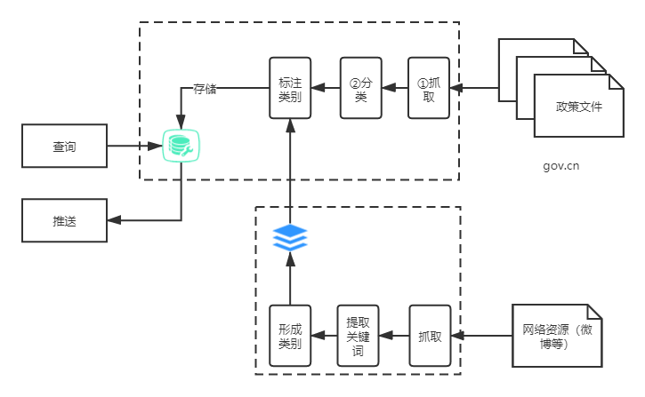

# 基于WEB的政策分析平台
## 是什么？
 * 提供一个分析/分类国家最新政策的平台
 * 为用户及时推送其所关注领域的最新政策和解读
### *参考文献*
 - *刘小吾.解读公共政策[J].湖南社会科学,2009,(4):184-188.*
 - *Akemi Takeoka Chatfield and Christopher G. Reddick. 2016. Open Data Policy Innovation Diffusion: An Analysis of Australian Federal and State Governments. In Proceedings of the 17th International Digital Government Research Conference on Digital Government Research (dg.o '16). Association for Computing Machinery, New York, NY, USA, 155–163. DOI:https://doi.org/10.1145/2912160.2912173*

## 为什么？
 * 移动互联网时代，公共政策发布/传播方式的变化
 * 人民/企业对政策的关注和支持度是否足够
 * 人民/企业对所关注政策和相关解读的需求
 * 如何更好落实相关政策
### *参考文献*
 - *习近平主持召开中央审计委员会第一次会议*
 - *孙向风.浅谈政策贯彻落实情况跟踪审计[J].中国经贸导刊,2019,(23):149-150. DOI:10.3969/j.issn.1007-9777.2019.23.062.*
 - *王宏伟,徐海龙.中国『双创』政策落实情况及优化建议[J].中国经贸导刊,2017,(34):68-70. DOI:10.3969/j.issn.1007-9777.2017.34.022.*
 - *Yumei Chen, Sharon S. Dawes, and Shanshan Chen. 2017. E-government Support for Administrative Reform in China. In Proceedings of the 18th Annual International Conference on Digital Government Research (dg.o '17). Association for Computing Machinery, New York, NY, USA, 329–335. DOI:https://doi.org/10.1145/3085228.3085269*

## 怎么做？
 * 利用网络爬虫搜集整理国家公共政策/解读
 * [可选]利用网络爬虫搜集人民/企业关注话题
 * 整理人民/企业关注话题，产生目标话题
 * 使用NLP技术对新政策进行分类与关键词标记
 * 根据语义相似度将新政策分类到相应的目标话题中
 * 根据用户关注话题推送相关政策及解读

### *参考文献*
 - *周付军，胡春艳：政府信息公开政策工具：结构、选择与优化 [J]. 图书馆，
2020（9）：014—021.*
 - *邱尔丽，何鸿魏，易成岐等．基于字符级CNN技术的公共政策网民支持度研究[J]．数据分析与知
识发现，2020，4(7)：28-37．(Qiu Erli，He Hongwei，Yi Chengqi，et a1．Research on Public Policy Support Based
on Character-level CNN Technology[J]．Data Analysis and Knowledge Discovery,2020，4(7)：28·37．)*
- *Theodoros Papadopoulos and Yannis Charalabidis. 2020. What do governments plan in the field of artificial intelligence? Analysing national AI strategies using NLP. In Proceedings of the 13th International Conference on Theory and Practice of Electronic Governance (ICEGOV 2020). Association for Computing Machinery, New York, NY, USA, 100–111. DOI:https://doi.org/10.1145/3428502.3428514*

**参考文献来自ACM Digital Library和万方**
